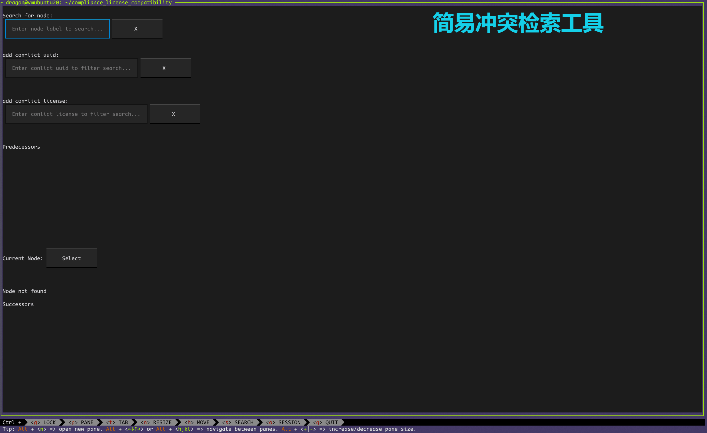

# compliance_license_compatibility

- [compliance\_license\_compatibility](#compliance_license_compatibility)
  - [Introduction](#introduction)
  - [Quick Start](#quick-start)
  - [Installation Guide](#installation-guide)
  - [Usage Instructions](#usage-instructions)
    - [Analyze Repository Compatibility (Ensure gn tool or gn build files are present)](#analyze-repository-compatibility-ensure-gn-tool-or-gn-build-files-are-present)
      - [Parameter List](#parameter-list)
      - [gn Dependency Graph Format](#gn-dependency-graph-format)
  - [Known Issues](#known-issues)
  - [Review Results](#review-results)
  - [Contributing](#contributing)
  - [Reproduction and Data Acquisition](#Reproduction-and-Data-Acquisition)

## Introduction

An open-source license compatibility analysis tool that performs compatibility analysis on the open-source licenses introduced in the target based on structured license information and dependency behaviors and build settings in specific scenarios.

Although we strive to ensure the accuracy and reliability of this tool, **the results of this project's checks do not constitute any legal advice**. Users should conduct their own reviews and judgments to determine whether the actions taken comply with laws, regulations, and the provisions of relevant licenses.

**Note: This project is currently in an early stage. The accuracy of the related results has not been verified, and significant changes to module interfaces are expected during iterations.**

## Quick Start

The current version only supports compatibility checks for OpenHarmony. You are welcome to use the one-click detection script [LSLOneClick](https://gitee.com/zionmoe/lict-one-click) for the full OpenHarmony source repository.

## Installation Guide

0. Ensure that `python 3.11^` is installed.
1. Clone the repository.
2. Navigate to the repository's root directory and run `pip install .`

**If you have installed a `lict` version before, please uninstall the old version first.**

## Usage Instructions

After ensuring the tool is installed, enter the command `liscopelens --help` in the terminal.

```shell
usage: liscopelens [-h] [-c CONFIG] {sbom,cpp} ...

Component Compatibility Analysis Tool

positional arguments:
  {sbom,cpp}
    sbom                Software Bill of Materials (SBOM) parser, this parser only supports the OH sbom format.
    cpp                 This parser is used to parse the C/C++ repository and provide an include dependency graph
                        for subsequent operations

options:
  -h, --help            show this help message and exit
  -c CONFIG, --config CONFIG
                        Path to the configuration file
```

### Analyze Repository Compatibility (Ensure gn tool or gn build files are present)

1. Obtain the OpenHarmony source code.
2. Install the OpenHarmony build tools and execute:
    ```shell
    ./build.sh --product-name {device_form} --gn-flags="--ide=json" --gn-flags="--json-file-name=out.json"
    ```
3. Ensure that `OpenHarmony/out/{device_form}/out.json` exists in the root directory of the source code.
4. Use Scancode to scan OpenHarmony licenses.
5. Execute `liscopelens` for compatibility scanning:
    ```shell
    liscopelens cpp --gn_file OpenHarmony/out/{device_form}/out.json --scancode-file path/to/scancode-res.json --output ./output
    ```
6. View `output/results.json` or use the [Review Tool](#review-results).

For additional parameters, check the help with `liscopelens cpp -h`. The explanation is as follows:
```shell
usage: liscopelens cpp [-h] (--gn_tool GN_TOOL | --gn_file GN_FILE)
                (--scancode-file SCANCODE_FILE | --scancode-dir SCANCODE_DIR) [--rm-ref-lang] [--save-kg]
                [--ignore-unk] [--out-gml OUT_GML] [--echo] [--out-echo OUT_ECHO]

options:
  -h, --help            show this help message and exit
  --gn_tool GN_TOOL     the path of the gn tool in executable form
  --gn_file GN_FILE     the path of the gn deps graph output file
  --scancode-file SCANCODE_FILE
                        The path of the scancode output in json format file
  --scancode-dir SCANCODE_DIR
                        The path of the directory that contains json files
  --rm-ref-lang         Automatically remove scancode ref prefix and language suffix from SPDX IDs
  --save-kg             Save new knowledge graph after infer parse
  --ignore-unk          Ignore unknown licenses
  --out-gml OUT_GML     The output path of the graph
  --echo                Echo the final result of compatibility checking
  --out-echo OUT_ECHO   The output path of the echo result
```

#### Parameter List

| Parameter       | Type | Description                                                                      | Required |
| --------------- | ---- | -------------------------------------------------------------------------------- | -------- |
| cpp             | bool | Indicates detection of a C/C++ code repository                                   | Yes      |
| --gn_tool       | str  | Path to the executable GN tool                                                   | Yes      |
| --gn_file       | str  | Path to the GN dependency graph output file                                      | Yes      |
| --scancode-file | str  | Path to the Scancode output in JSON format                                       | Yes      |
| --scancode-dir  | str  | Path to the directory containing JSON files                                      | Yes      |
| --rm-ref-lang   | bool | Automatically remove Scancode reference prefix and language suffix from SPDX IDs | No       |
| --save-kg       | bool | Save the new knowledge graph after parsing                                       | No       |
| --ignore-unk    | bool | Ignore unknown licenses                                                          | No       |
| --out-gml       | str  | Output path for the graph                                                        | No       |
| --echo          | bool | Echo the final result of compatibility checking                                  | No       |
| --out-echo      | str  | Output path for the echo result                                                  | No       |

#### gn Dependency Graph Format

```json
{
  "build_settings": {
    "build_dir": "//out/hispark_taurus/ipcamera_hispark_taurus/",
    "default_toolchain": "//build/lite/toolchain:linux_x86_64_ohos_clang",
    "gen_input_files": [
      "//.gn",
      "//vendor/hisilicon/hispark_taurus/hdf_config/BUILD.gn",
      "//vendor/hisilicon/hispark_taurus/hdf_config/hdf_test/BUILD.gn"
    ],
    "root_path": "/home/dragon/oh"
  },
  "targets": {
    "//applications/sample/camera/cameraApp:cameraApp_hap": {
      "all_dependent_configs": [
        "//third_party/musl/scripts/build_lite:sysroot_flags"
      ],
      "deps": [
        "//applications/sample/camera/cameraApp:cameraApp",
        "//developtools/packing_tool:packing_tool",
        "//third_party/musl:sysroot_lite"
      ],
      "metadata": {
      },
      "outputs": [
        "//out/hispark_taurus/ipcamera_hispark_taurus/obj/applications/sample/camera/cameraApp/cameraApp_hap_build_log.txt"
      ],
      "public": "*",
      "script": "//build/lite/hap_pack.py",
      "testonly": false,
      "toolchain": "//build/lite/toolchain:linux_x86_64_ohos_clang",
      "type": "action",
      "visibility": [
        "*"
      ]
    },
    "//foundation/arkui/ace_engine_lite/frameworks/src/core/stylemgr/test/unittest:stylemgr_unittest": {
         "all_dependent_configs": [ "//third_party/musl/scripts/build_lite:sysroot_flags" ],
         "deps": [ "//foundation/arkui/ace_engine_lite/frameworks/src/core/stylemgr/test/unittest:js_frameworks_test_condition_arbitrator", "//foundation/arkui/ace_engine_lite/frameworks/src/core/stylemgr/test/unittest:js_frameworks_test_link_queue", "//foundation/arkui/ace_engine_lite/frameworks/src/core/stylemgr/test/unittest:js_frameworks_test_link_stack", "//foundation/arkui/ace_engine_lite/frameworks/src/core/stylemgr/test/unittest:js_frameworks_test_stylemgr", "//foundation/arkui/ace_engine_lite/frameworks/src/core/stylemgr/test/unittest:js_frameworks_test_stylemgr_media_query" ],
         "metadata": {

         },
         "public": "*",
         "testonly": false,
         "toolchain": "//build/lite/toolchain:linux_x86_64_ohos_clang",
         "type": "group",
         "visibility": [ "*" ]
      }
  }
}
```

## Known Issues

1. `poetry install | add` is unresponsive or reports errors such as `Failed to unlock the collection`.

```shell
export PYTHON_KEYRING_BACKEND=keyring.backends.null.Keyring
```

## Review Results

After execution, review conflict results (ensure to pass the output path parameter `liscopelens <command> ... --output path/to/output_dir`).

```shell
liscopelens query /path/to/output_dir
```



## Contributing

Refer to the [Design Document](doc/设计文档.md#开发手册) for more details.

## Reproduction and Data Acquisition

To reproduce the results of the CASE STUDY in this work, please obtain the source code of [OpenHarmony 5.0 beta version](https://gitcode.com/openharmony/docs/blob/OpenHarmony-5.0-Beta1/en/release-notes/OpenHarmony-v5.0-beta1.md#source-code-acquisition).  
After that, you can use our one-click script for verification:  

[https://gitee.com/zionmoe/liscopelens-one-click](https://gitee.com/zionmoe/liscopelens-one-click) 

The license risk modification results confirmed by this work can be found at:

[https://gitcode.com/openharmony/third_party_musl/commit/fdeaedb7e9448c2bb071099a4d6623c011a39cc3](https://gitcode.com/openharmony/third_party_musl/commit/fdeaedb7e9448c2bb071099a4d6623c011a39cc3)